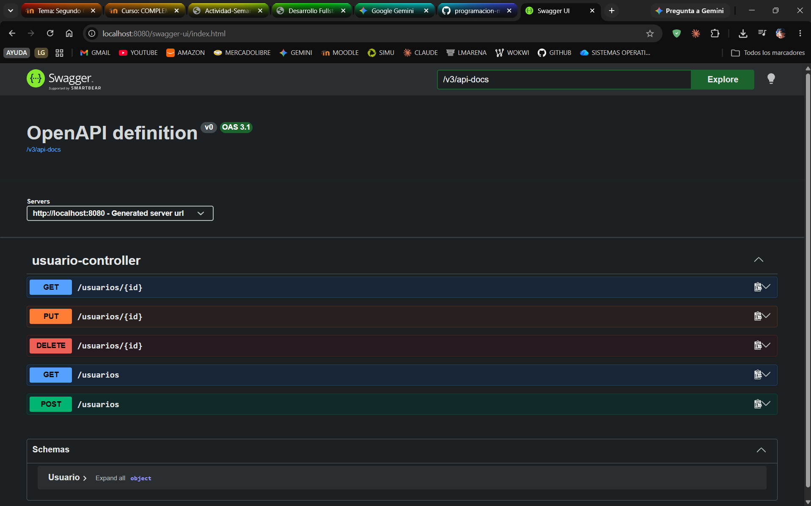
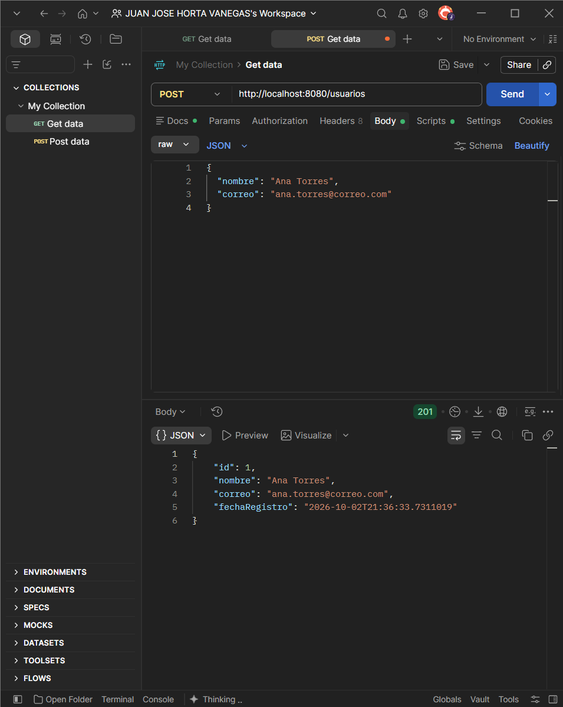
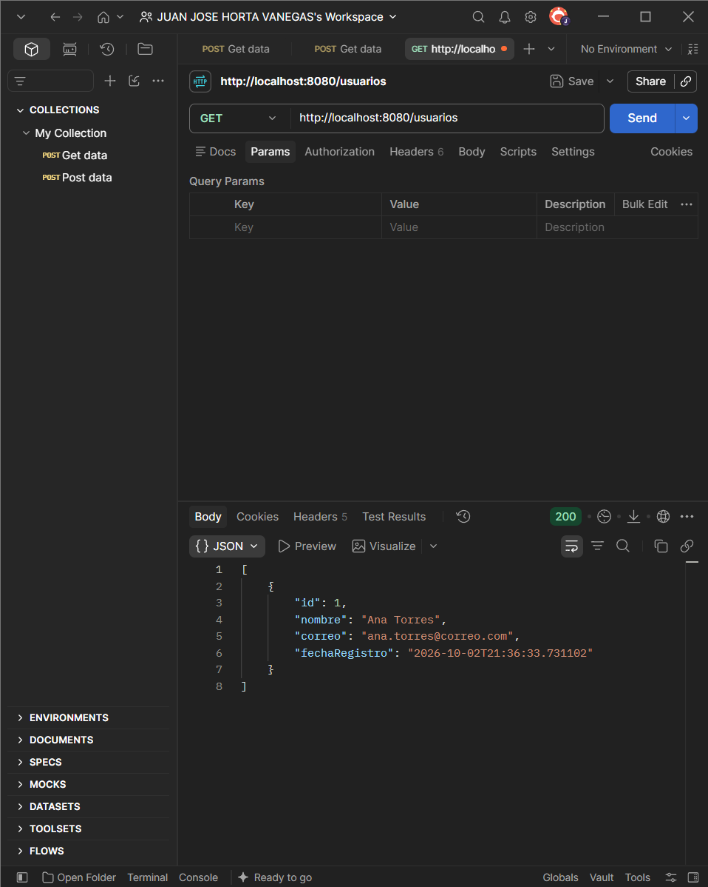
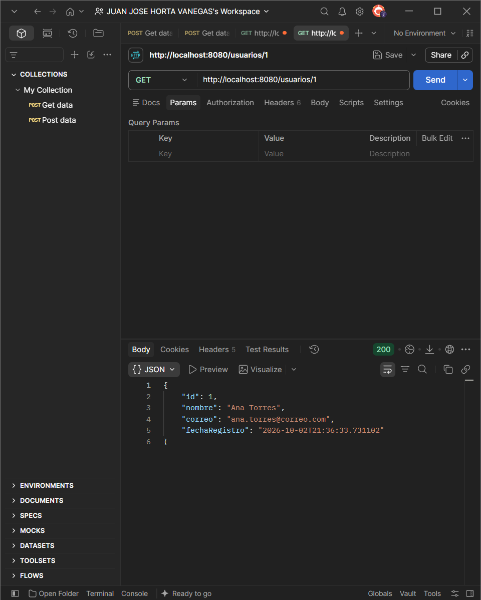
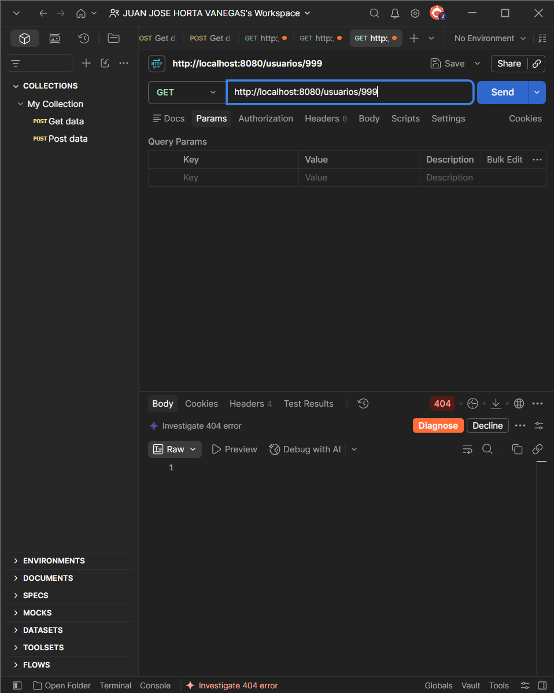

# Swagger y pruebas con Postman · API de usuarios de ScoreSound

Semana 9 · Corte 2 · Desarrollo Fullstack · CORHUILA

Las pruebas se hicieron con Postman 12 contra la API de usuarios corriendo en `http://localhost:8080`, con la base H2 en memoria recién arrancada. Como arranca vacía, el orden de las peticiones importa: primero se crea el usuario y solo después hay algo que listar o consultar.

## Swagger activo

Se agregó la dependencia `springdoc-openapi-starter-webmvc-ui` en su versión 2.9.1, la rama compatible con Spring Boot 3. Con la API arriba, `http://localhost:8080/swagger-ui.html` redirige a `/swagger-ui/index.html` y muestra los cinco endpoints del controller más el esquema `Usuario`, sin haber escrito una sola línea de documentación a mano.

## Pruebas en Postman

| # | Petición | Qué se probó | Esperado | Obtenido |
|---|---|---|---|---|
| 1 | `POST /usuarios` | Crear un usuario | 201 | **201** |
| 2 | `GET /usuarios` | Listar todos | 200 | **200** |
| 3 | `GET /usuarios/1` | Obtener uno por su id | 200 | **200** |
| 4 | `GET /usuarios/999` | Pedir un id que no existe | 404 | **404** |

### 1. Crear · POST /usuarios

Cuerpo enviado: `{ "nombre": "Ana Torres", "correo": "ana.torres@correo.com" }`

### 2. Listar · GET /usuarios

### 3. Obtener · GET /usuarios/1

### 4. Caso de error · GET /usuarios/999

## Qué significa cada código en esta API

**201 Created** es la respuesta del `POST`, y no es lo mismo que un 200. Un 200 dice "la petición salió bien"; un 201 dice además "ahora existe algo que antes no existía". En este caso el service le asignó un `id` y una `fechaRegistro` al usuario, y el controller los devolvió en la respuesta. Eso es justo lo que el frontend necesita: tomar el `id` que llegó para agregar el usuario a la lista o navegar a su detalle, sin tener que volver a preguntarle nada al servidor.

**200 OK** apareció dos veces, pero con respuestas de forma distinta. Al listar llega un arreglo entre corchetes; al pedir `/usuarios/1` llega un solo objeto. Para el frontend la diferencia es decisiva, porque uno se recorre para pintar filas y el otro se muestra como un detalle. Y vale notar que una lista vacía también sería un 200, con `[]`: que no haya usuarios no es un error, es una respuesta válida, y la pantalla debería decir "aún no hay usuarios" en vez de mostrar un mensaje de falla.

**404 Not Found** es el caso de error. La petición estaba bien escrita, el problema es que el usuario 999 nunca se creó. La respuesta llegó sin cuerpo porque el controller responde con `notFound().build()`, que no lleva contenido: el código ya lo dice todo. Con esto el frontend puede mostrar "usuario no encontrado" en lugar de un error genérico, y distinguirlo de los otros dos fallos posibles: un 400 significaría que lo mal hecho es la petición, y un 500 que lo roto es el servidor. El mismo 404 lo devuelven también `PUT` y `DELETE` cuando el id no existe.

## Lo que no se probó aquí

El `DELETE` exitoso, que responde 204, ya se había comprobado en la semana 8 con el script de pruebas, no con Postman. Tampoco hay un caso 400 provocado por reglas de negocio, porque la API todavía no valida los campos: un nombre en blanco (`""`) se guardaría tal cual. Para la actividad bastaba con un caso de error y se usó el 404.
